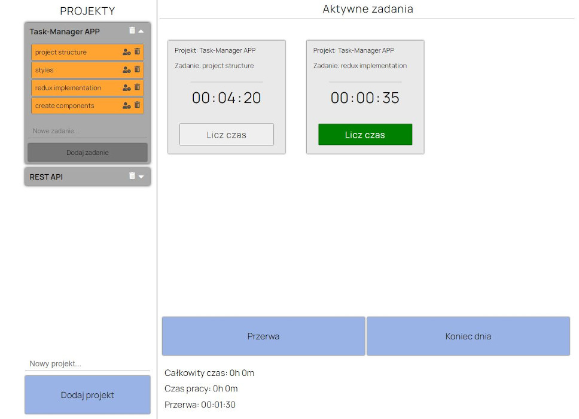
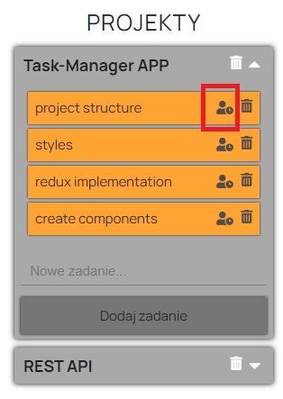
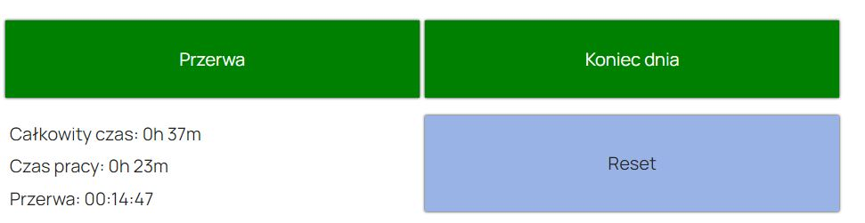

# Work Time Counter

## Introduction

Work Time Counter is application for recording the time spent on individual tasks.
Project and tasks are stored in localStorage. The application is responsive only for desktop, there is no mobile version.
You can find application demo [here](https://mtkuchta.github.io/workTimeCounter/).

## Technologies

- JavaScript,
- SCSS,
- LocalStorage,
- Webpack,

## Setup

To run this project, install it locally using npm:

$ cd ../lorem  
$ npm install  
$ npm start

## How to use Work Time Counter?

1. In the "PROJEKTY" section define your projects using "DODAJ PROJEKT" button, and then tasks in projects using "Dodaj zadanie" button. Then you can add tasks to active tasks board :

2. You can start counting time using buttons "Licz czas" or "Przerwa" when you have break time. From this point, the counter cannot be stopped unless you and the day using "Koniec dnia" button.
   If you confirm the end of the day counter is inactive and the time summary will be shown at the bottom.

3. To start counting the time of the next day click "Reset" button and then define active tasks.

## Features

- Define projects and tasks inside projects,
- Delete projects and tasks,
- Add tasks to active tasks board,
- Counting time spent on task or break time,
- Switch between tasks,
- Day summary (total time, break time, work time),
